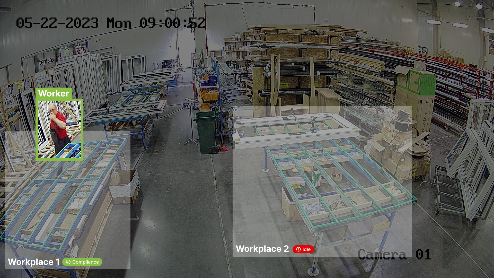

<h1>MONITOR THE EMPLOYEES THAT USE MACHINES IN YOUR MANUFACTURING</h1>
  
<strong>Machine control</strong> is one of the Official <a href="https://5scontrol.com/">5sControl</a> algorithm. Plug it in our video monitoring system with AI analysis and ERP Integration (Open Source) to increase the efficiency of your processes.
  
Designed to handle complex industrial processes with ease, this <strong>innovative tool</strong> is perfect for use with semi-automated equipment. With Machine Control you can <strong>optimize your industrial processes</strong> and keep your equipment running smoothly, <strong>saving you time and money</strong>.

  

  

    

 <h2>MACHINE CONTROL FEATURES</h2>
  
  <table align="center">
    <tr>
      <td class="feature">
        <h3>Monitoring of employees using the equipment</h3>
        
By tracking and analyzing equipment usage in real-time, you can identify any bottlenecks, make data-driven decisions to improve workflow, and enhance overall operational performance. This feature helps streamline processes for increased productivity and cost-effectiveness.

      </td>
      <td class="feature">
        <h3>Prevention of equipment downtime</h3>
        
By minimizing unplanned downtime, you can maximize equipment uptime, optimize productivity, and avoid costly disruptions, ultimately ensuring smooth operations and protecting your valuable assets.

      </td>
      </tr>
  </table>

     

<h2>HOW EFFICIENT IS YOUR EQUPMENT?</h2>
   
  

  <iframe src="https://www.youtube.com/embed/vo3D6JPXu-k" frameborder="0" allow="accelerometer; autoplay; clipboard-write; encrypted-media; gyroscope; picture-in-picture" allowfullscreen style="position: absolute; top: 0; left: 0; width: 80%; height: 80%;"></iframe>

<h3>Learn more about Machine control on the <strong><a href="https://5scontrol.com/solutions/machine-control">5sControl website</a></strong>.</h3>
  

