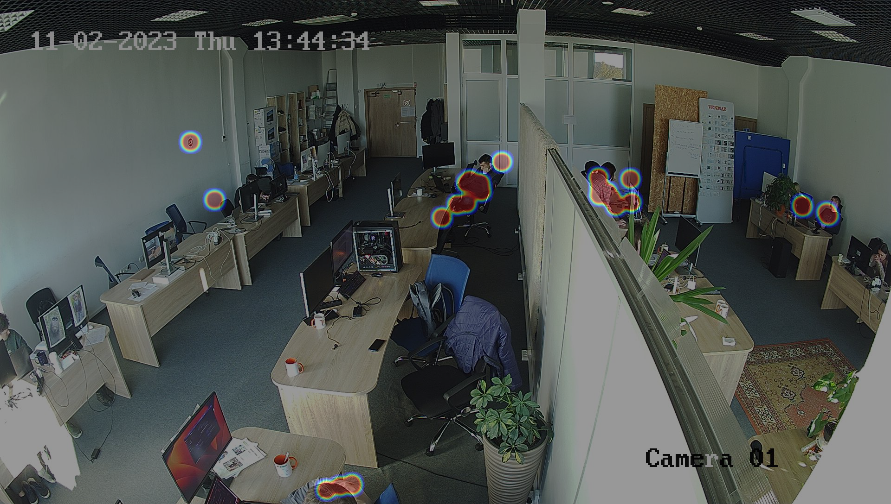

<h1>IDENTIFY OVERLOADED AND UNDERLOADED AREAS OF YOUR PRODUCTION</h1>
  
Human-Tracker is one of the Official <a href="https://5scontrol.com/">5sControl</a> algorithms.
  
With Human-Tracker, you can now effortlessly <strong>identify overloaded and underloaded areas</strong> of your production. Our software helps you <strong>maintain the optimal workplace load</strong> by providing <strong>real-time movement tracking and heatmaps</strong>, allowing you to make informed decisions and <strong>avoid costly workplace load disproportions</strong>. 

  

  

    

 <h2>HUMAN TRACKER FEATURES</h2>
  
  <table align="center">
    <tr>
      <td class="feature">
        <h3>Tracking movements of your employees</h3>
        
This feature enhances operational visibility, facilitates efficient resource allocation, and promotes accountability. By tracking employee movements, the software helps optimize workflow management, improve productivity, and enhance overall operational efficiency.

      </td>
      <td class="feature">
        <h3>Creating heatmaps of workplace load</h3>
        
By analyzing data on employee movements, the software generates heatmaps that highlight areas of high or low activity. This feature helps you identify congestion points, optimize space utilization, and make informed decisions for process improvement or resource allocation.

      </td>
      </tr>
  </table>

     

<h3>Learn more about Heat-Map on the <a href="https://5scontrol.com/">5sControl website</a>.</h3>
  
