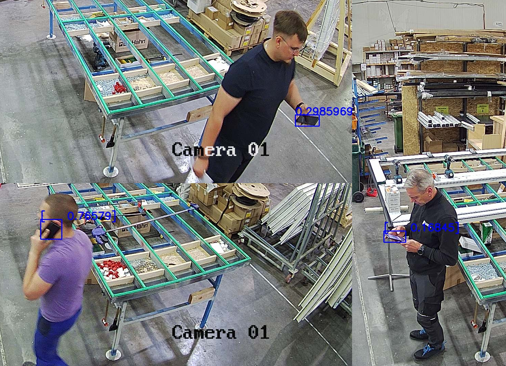

<h1>About Idle control</h1>

Idle control is one of the Official <a href="https://5controls.com/">5controlS</a> algorithms. Plug it in our <strong>video monitoring system with AI analysis and ERP Integration</strong> (Open Source) to uncover employee inefficiencies and minimize downtime.
  
Take charge of your team's workforce and ensure maximum productivity. Employees spend time on non-work activities, such as social media or phone calls in the workplace? <strong>Optimize your team's or company’s efficiency</strong> without delay.

  

<h2>Key features</h2>
<ul>
<li>detects idle or unproductive time;</li>
<li>locates employees when needed.</li>
</ul>

<strong>Plug-in Idle control to 5controlS platform to start detecting when your workers are on a phone!</strong>

Learn more about Idle control on the <a href="https://5controls.com/solutions/employee-monitoring-software">5controlS website</a>.
