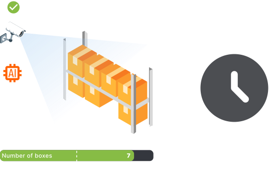
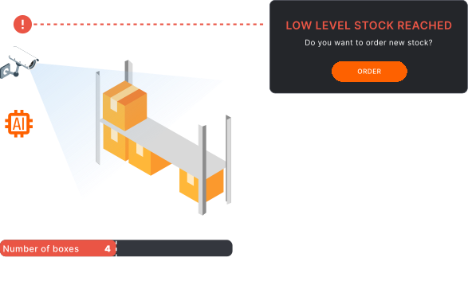

<head>
  
</head>
<body>
<h1>INVENTORY CONTROL - REMOTE INVENTORY TRACKING FOR YOUR PRODUCTION</h1>

Inventory control is one of the Official <a href="https://5controls.com/">5controlS</a> algorithms. Plug it in our <strong>video monitoring system with AI analysis and ERP Integration</strong> (Open Source) to facilitate supply chain management and keep up the optimal stock levels.
  
With Inventory control, you can now effortlessly <strong>remotely manage your manufacturing reserves</strong> and ensure smooth and uninterrupted production processes. Our software helps you <strong>maintain the optimal stock levels</strong> by providing <strong>real-time inventory tracking</strong> and analysis, allowing you to make informed decisions and avoid costly production line stoppages. 

  

<strong>Plug-in Inventory control to 5controlS platform to start monitoring your inventory level remotely!</strong>
  

 <h2>INVENTORY CONTROL FEATURES</h2>
  <table align="center">
    <tr>
      <td class="feature">
        <h3>Real-time remote stock levels monitoring</h3>
        
Our software enables real-time remote monitoring of stock levels, giving you immediate visibility into your inventory from anywhere. By providing up-to-date information on materials and products, you can make informed decisions, prevent stockouts or overstocking, and optimize your supply chain.

      </td>
      <td class="feature">
        <h3>Automatic ordering for just-in-time deliveries</h3>
        
Our software provides the convenience of automatic ordering, enabling efficient procurement and minimizing inventory holding costs. By monitoring stock levels and triggering automated purchase orders, it ensures timely replenishment and reduces the risk of overstocking or stockouts.

      </td>
      </tr>
     <tr>
            <td class="feature">
        <h3>Notifications about critical levels</h3>
        
With our software, you can receive timely notifications about low stock levels, ensuring that you never run out of essential materials or products. Our system monitors your inventory levels in real-time and proactively alerts you when stock reaches a predefined threshold.

      </td>
             <td class="feature">
        <h3>Improved customer satisfaction</h3>
        
Through streamlined processes, accurate inventory management, and efficient order fulfillment, you can ensure timely deliveries, minimize errors, and provide a seamless experience that delights your customers, ultimately fostering long-term loyalty and positive brand perception.

      </td>
    </tr>
  </table>

<h2>KEEP TRACK OF YOUR INVENTORY WITH 5S CONTROL</h2>

  &emsp;&emsp;&emsp;&ensp;
  

<h3>Learn more about Inventory control on the <a href="https://5controls.com/solutions/inventory-control">5controlS website</a>.</h3>
</body>
