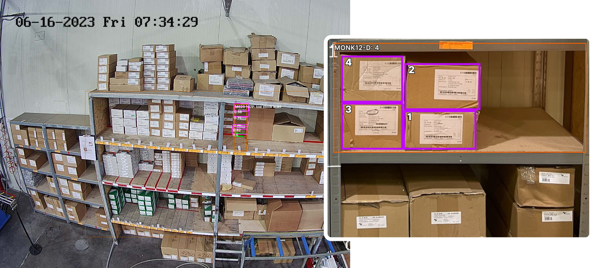

<h1>Inventory control - real-time inventory tracking for you production</h1>

Inventory control is one of the Official <a href="https://5controls.com/">5controlS</a> algorithms. Plug it in our <strong>video monitoring system with AI analysis and ERP Integration</strong> (Open Source) to facilitate supply chain management and keep up the optimal stock levels.
  
With Inventory control, you can now effortlessly <strong>manage your manufacturing reserves</strong> and ensure smooth and uninterrupted production processes. Our software helps you <strong>maintain the optimal stock levels</strong> by providing <strong>real-time inventory tracking</strong> and analysis, allowing you to make informed decisions and avoid costly production line stoppages. 

  

<h2>Key features of Inventory control</h2>
<ul>
<li>real-time stock levels monitoring;</li>
<li>notifications about critical levels;</li>
<li>automatic ordering for just-in-time deliveries.</li>
</ul>

<strong>Plug-in Inventory control to 5controlS platform to start monitoring your inventory level!</strong>
  
Learn more about Inventory control on the <a href="https://5controls.com/solutions/inventory-control">5controlS website</a>.
