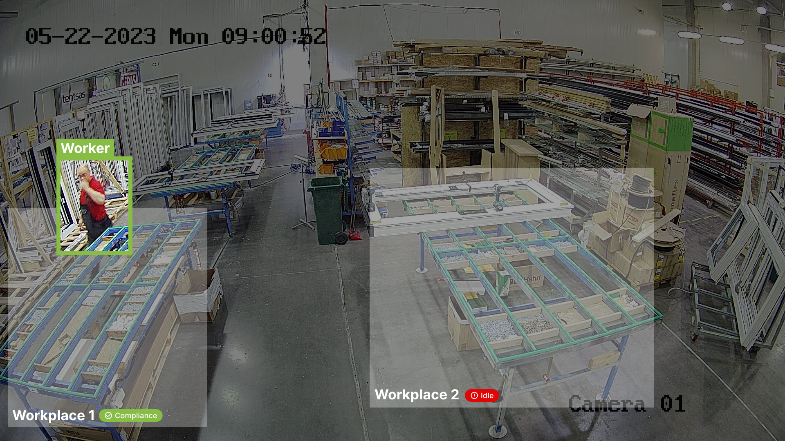

<head>
  
</head>

<body>

<h1> About Machine control</h1>

<strong>Machine control</strong> is one of the Official <a href="https://5controls.com/">5controlS</a> algorithm. Plug it in our video monitoring system with AI analysis and ERP Integration (Open Source) to increase the efficiency of your processes.
  
Designed to handle complex industrial processes with ease, this <strong>innovative tool</strong> is perfect for use with semi-automated equipment. With Machine Control you can <strong>optimize your industrial processes</strong> and keep your equipment running smoothly, <strong>saving you time and money</strong>.

  

<h2>Key features</h2>
<ul>
<li>monitors use of equipment;</li>
<li>prevents downtime of valuable and expensive equipment.</li>
</ul>

<strong>Plug-in Machine control to 5controlS platform to detect when your workers are absent!/<strong>
  
Learn more about Machine control on the <strong><a href="https://5controls.com/solutions/machine-control">5controlS website</a></strong>.
 

