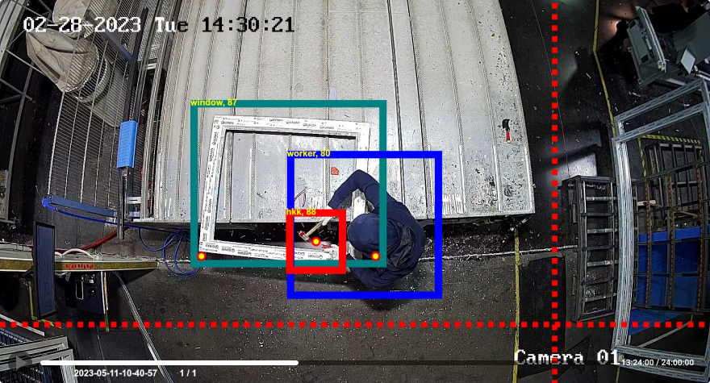

<h1>Operation control - software for manufacturing process monitoring</h1>

Operation Control is one of the Official <a href="https://5controls.com/">5controlS</a> algorithms. Plug it in our <strong>video monitoring system with AI analysis and ERP Integration</strong> (Open Source) to ensure the quality of your products.
  

Empowers you to monitor and control the execution of technologically necessary number of operations with ease. Our advanced AI algorithms provide <strong>real-time insights and predictions</strong>, enabling you to <strong>optimize your operations</strong> for maximum efficiency and profitability.

  

<h2>Key features of Operation control</h2>
<ul>
<li>ensures window seam trimming operations are completed correctly;</li>
<li>detects missing operations.</li>
</ul>

<strong>Plug-in Operation control to 5controlS platform to start monitoring window seam trimming operations!</strong>
  
Learn more about Operation control on the <a href="https://5controls.com/solutions/operation-control">5controlS website</a>.
