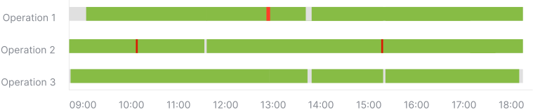

<h1>MANUFACTURING PROCESS MONITORING WITH OPERATION CONTROL</h1>
  
Operation Control is one of the Official <a href="https://5controls.com/">5controlS</a> algorithms. Plug it in our <strong>video monitoring system with AI analysis and ERP Integration</strong> (Open Source) to ensure the quality of your products.
  
Empowers you to monitor and control the execution of technologically necessary number of operations with ease. Our advanced AI algorithms provide <strong>real-time insights and predictions</strong>, enabling you to <strong>optimize your operations</strong> for maximum efficiency and profitability.

  

  

    

 <h2>OPERATION CONTROL FEATURES</h2>
  
  <table align="center">
    <tr>
      <td class="feature">
        <h3>Ensures operations are completed correctly</h3>
        
Through automated checks, and real-time monitoring, it verifies that each task or operation is executed accurately and in compliance with predefined standards. By minimizing human errors and deviations, this feature promotes consistency, quality assurance, and regulatory compliance.

      </td>
      <td class="feature">
        <h3>Detects missing operations</h3>
        
By comparing the actual execution of tasks against the expected sequence, Operation control alerts users to any missing steps or operations that may have been inadvertently skipped. This feature enhances operational integrity, reduces the risk of errors or oversights, ultimately contributing to improved efficiency, accuracy, and overall process effectiveness.

      </td>
      </tr>
  </table>

     

<h2>WITHOUT 5CONTROLS</h2>
  

  &emsp;&emsp;&emsp;&ensp;
  

  

<h2>WITH 5CONTROLS</h2>
  

  &emsp;&emsp;&emsp;&ensp;
  

  

<h2>Learn more about Operation control on the <a href="https://5controls.com/solutions/operation-control">5controlS website</a>.</h2>

  
