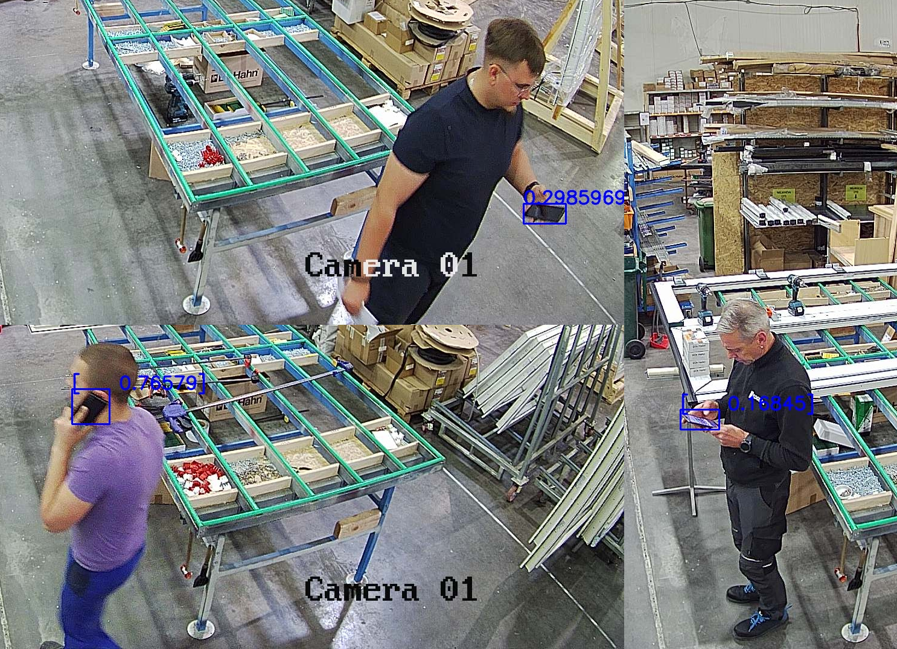

<h1>IDENTIFY THE EMPLOYEES WHO USE A MOBILE IN THE WORKPLACE</h1>
  
Idle control is one of the Official <a href="https://5scontrol.com/">5sControl</a> algorithms. Plug it in our <strong>video monitoring system with AI analysis and ERP Integration</strong> (Open Source) to uncover employee inefficiencies and minimize downtime.
  
Take charge of your team's workforce and ensure maximum productivity. Employees spend time on non-work activities, such as social media or phone calls in the workplace? <strong>Optimize your team's or company’s efficiency</strong> without delay.

  

  

    

 <h2>IDLE CONTROL FEATURES</h2>
  
  <table align="center">
    <tr>
      <td class="feature">
        <h3>Detects idle or unproductive time</h3>
        
By promoting a more efficient and focused work environment, it helps organizations optimize resource allocation, improve operational efficiency, and achieve higher levels of productivity.

      </td>
      <td class="feature">
        <h3>Locates employees when needed</h3>
        
By streamlining employee location tracking, the software helps optimize resource allocation, enhance workflow management, and ensure timely and effective decision-making.

      </td>
      </tr>
  </table>

     

<h2>THE EXAMPLE OF MONITORING EMPLOYEES IN THE WORKPLACE</h2>
 

  <iframe src="https://www.youtube.com/embed/CrLRqwJ1bzQ?si=flWEX7jKGUVz-WPI" frameborder="0" allow="accelerometer; autoplay; clipboard-write; encrypted-media; gyroscope; picture-in-picture" allowfullscreen style="position: absolute; top: 0; left: 0; width: 80%; height: 80%;"></iframe>

<h3>Learn more about Idle control on the <a href="https://5scontrol.com/solutions/employee-monitoring-software">5sControl website</a>.</h3>
  
